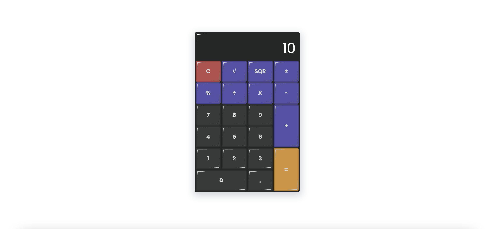

## Написать калькулятор.

Запуск проекта: `npm start`

Дев сборка: `npm dev`

Прод сборка:  `npm build`

#### [ >>>> Ссылка на деплой <<<<](https://andersen-6-lesson.vercel.app/)

Обязательными являются (сложение, вычитание, деление, умножение, корень, возведение в квадрат, изменение знака). Остальное - опять же на ваше усмотрение. Можете сделать даже инженерный калькулятор, но оценивать буду в первую очередь по тем функциям, что есть тут.

Поле для ввода должно быть заблокировано от прямого пользовательского ввода (readonly). Ввод должен осуществляться путём нажатия на кнопки калькулятора (обязательно) или же клавиши клавиатуры (опционально). Числа выводим с точностью до 8 знака после запятой включительно. По 9 знаку округляем и всё ненужное обрезаем.

Как именно реализовывать (через отображение всех составляющих операции, через отображение только последнего введённого значения, ещё как-то) - неважно. Главное, чтобы соблюдался обычный флоу любого калькулятора. Ввод числа, выбор операции, ввод ещё одного числа, выбор новой операции или же вывод результата и т.д.

